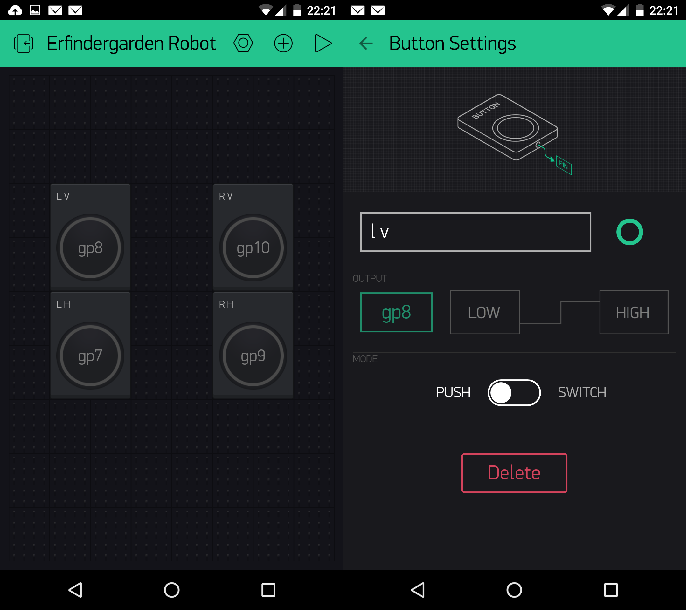

# Fernsteuerung mit Blynk
[Blynk](http://www.blynk.cc/) ist eine Smartphone-App, mit der man User-Interfaces für Arduino, RasPi, etc. bauen kann. Hier eine kurze Anleitung, wie man damit den Roboter fernsteuern kann.


### 1. Blynk am Smartphone installieren
1. Download für [iOS](https://itunes.apple.com/us/app/blynk-control-arduino-raspberry/id808760481?ls=1&mt=8) oder [Android](https://play.google.com/store/apps/details?id=cc.blynk)
2. Registrieren / Anmelden
3. "Create New Project"
4. Bei "Hardware Model" **Raspberry Pi 2/A+/B+** auswählen
4. *Auth-Token* notieren für später


### 2. Blynk auf dem RasPi einrichten
**Der RasPi muss zur Installation und zum Betrieb mit Blynk mit dem Internet verbunden sein!**

Die ganze Anleitung findest du auch hier: [https://github.com/blynkkk/blynk-library/blob/master/linux/README.md](https://github.com/blynkkk/blynk-library/blob/master/linux/README.md)

#### A. Voraussetzung: WiringPi installieren
```bash
sudo apt-get install git-core
git clone git://git.drogon.net/wiringPi
cd wiringPi
./build
cd ..
```
Die ausführliche Anleitung gibt's auch nochmal hier: [http://wiringpi.com/download-and-install/](http://wiringpi.com/download-and-install/)

#### B. Blynk kompilieren
```bash
git clone https://github.com/blynkkk/blynk-library.git
cd blynk-library/linux
make clean all target=raspberry
```

#### C. Blynk starten
Hier muss der vorher generierte *Auth-Token* eingesetzt werden:

```bash
sudo ./blynk --token=AUTH-TOKEN
```


### 3. Interface designen in Blynk

1. Erstelle ein Interface mit vier Buttons: Für jedes Rad zwei Buttons, einen für vorwärts, einen für rückwärts.
2. Weise jedem Button den entsprechenen GPIO Pin zu:
	* Links vorwärts: gp8
	* Links rückwärts: gp7
	* Rechts vorwärts: gp10
	* Rechts rückwärts: gp9
3. Stelle den 'Mode'-Schalter für jeden Button auf 'push'
4. Drücke rechts oben den "Play"-Button
5. Jetzt kannst du mit zwei Fingern deinen Roboter steuern


